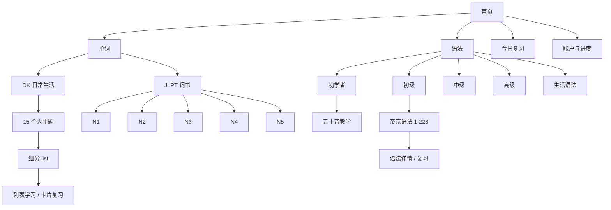

# ことのは / KOTONOHA 产品需求文档

**版本：** 1.0  
**日期：** 2026-07-14  
**状态：** 待产品确认  
**产品类型：** 日语词汇与语法学习网站  
**首发平台：** Web（桌面与移动端响应式）  
**部署目标：** Vercel  
**数据与身份：** Neon PostgreSQL + Neon Auth

## 1. 产品概述

KOTONOHA 是一个面向中文母语日语学习者的自学网站。它把分散在词书和语法资料中的内容整理成可浏览、可记忆、可复习、可追踪进度的学习路径。

第一版以两份现有资料为基础：

- DK《Japanese-English Bilingual Visual Dictionary》：362 页，封面标示收录超过 6,000 个词与短语。网站保留原书按生活场景组织的层级，清楚区分每个主题与细分 list。
- 成都帝京日语学校《初级语法汇总》：20 页，编号 1-228 的语法条目。网站将条目整理为可检索、可收藏和可复习的初级语法课程。

网站同时预留 JLPT N1-N5 词书目录，以及初学者、初级、中级、高级和生活语法五条语法路径。首发时，未有合法内容源的目录以“内容准备中”呈现，不编造学习内容。

## 2. 产品目标

1. 用户能在 30 秒内找到想学的词书、主题 list 或语法级别。
2. DK 的主题结构在网页上保持清晰，用户能从“大主题 -> list -> 单词”逐级进入。
3. 用户能用“忘记 / 模糊 / 认识”完成单词或语法复习，并获得下一次复习日期。
4. 登录用户的进度、收藏和学习记录长期保存到 Neon，并能跨设备恢复。
5. 首页“今日一词”同一天保持不变，并在 Asia/Hong_Kong 时区每天零点更换。
6. 新增词书或语法资料时只需导入数据，不需要重写页面结构。
7. 任一存在版权问题的内容源可以通过一个开关立即从前台下架。

## 3. 目标用户

### 核心用户

- 中文母语的日语自学者。
- 从五十音开始的完全初学者。
- 已学习初级语法、需要系统复习的人。
- 希望按生活场景积累日常词汇的人。
- 后续准备 JLPT N5-N1 的考生。

### 核心任务

- 按主题浏览并背诵词汇。
- 学习五十音与基础发音。
- 查找、理解并收藏语法。
- 完成每日复习队列。
- 在不同设备继续上次的学习位置。

## 4. 首发范围

### 必须上线

- 首页：今日一词、单词/语法双入口、继续学习。
- 单词总目录：DK 日常生活、JLPT 入口。
- DK 目录：大主题、细分 list、列表学习和卡片复习。
- JLPT 目录：N1、N2、N3、N4、N5 五个级别的现有页面结构。
- 语法总目录：初学者、初级、中级、高级、生活语法。
- 初学者：五十音教学，包括平假名、片假名、行组、罗马音、基础发音与自测。
- 初级语法：帝京资料 1-228 条的目录、详情与复习入口。
- 搜索：按日文、假名、罗马音、中文释义和英文释义查找。
- 用户系统：注册、登录、退出和会话恢复。
- 学习进度：项目状态、复习日期、收藏、学习时长和最后学习位置。
- 本地离线缓存：网络暂时不可用时仍可记录学习动作，恢复后自动同步。
- 内容源开关：按整本词书或整套语法资料快速下架。

### 预留但首发不填充内容

- JLPT N1-N5 的具体词条。
- 中级、高级和生活语法的具体条目。
- 社交排行榜、班级、付费订阅和教师后台。

## 5. 信息架构

### DK 大主题

DK 目录按原书整理为 15 个一级主题：人物、外观、健康、家庭、服务、购物、食物、外出用餐、学习、工作、交通、运动、休闲、环境和参考资料。每个一级主题下保留原书的细分 list，例如“人物 -> 身体 / 面部 / 手 / 足 / 家庭 / 情绪”等。

## 6. 路由结构

| 路由 | 用途 |
| --- | --- |
| `/` | 首页 |
| `/vocabulary` | 词书目录 |
| `/vocabulary/dk` | DK 大主题目录 |
| `/vocabulary/dk/[category]` | 某个 DK 大主题下的 lists |
| `/vocabulary/dk/[category]/[list]` | 某个 list 的词汇页 |
| `/vocabulary/jlpt` | JLPT N1-N5 目录 |
| `/vocabulary/jlpt/[level]` | 单个 JLPT 级别页面 |
| `/grammar` | 语法级别目录 |
| `/grammar/beginner` | 初学者课程 |
| `/grammar/beginner/kana` | 五十音教学 |
| `/grammar/[level]` | 某个语法级别目录 |
| `/grammar/[level]/[slug]` | 单个语法条目详情 |
| `/review` | 今日复习队列 |
| `/search` | 全站搜索 |
| `/sign-in` | 登录与注册 |
| `/profile` | 个人进度、收藏和设置 |

## 7. 页面需求

### 7.1 首页

- 顶部显示品牌、搜索、收藏和账户入口。
- 主视觉为“今日一词”标本条：日文、假名、中文释义、英文释义、来源和发音按钮。
- 今日一词按 Asia/Hong_Kong 日期计算；同一日期内刷新不变，午夜后切换。
- 页面中段为单词和语法两条主要路径，不使用通用仪表盘卡片堆叠。
- 页面底部显示一条“继续学习”，未登录或无历史时改为“开始第一次学习”。
- 背景使用低对比度和纸肌理、淡墨芒草和压印假名；装饰不得覆盖文本或妨碍对比度。

### 7.2 单词目录

- 首发显示 DK 日常生活和 JLPT 两本目录入口。
- DK 显示真实导入条目数和 list 数；未完成导入时不显示估算值。
- JLPT 显示 N1-N5 五个入口；没有内容的级别明确标记“内容准备中”。

### 7.3 DK 主题与 list

- 一级主题按原书顺序展示。
- 每个主题显示包含的 list 名称、已学习数量和总数。
- list 页面支持两种模式：可扫描的词汇列表、逐个学习的翻卡模式。
- 每个词条至少包含日文、假名、罗马音、中文释义、英文释义、来源页码和发音按钮。
- 用户可收藏词条，并选择“忘记 / 模糊 / 认识”。

### 7.4 JLPT 目录

- 进入 JLPT 后直接看到 N1、N2、N3、N4、N5。
- 信息层级说明 N5 为入门、N1 为最高级，但不虚构官方词汇量。
- 新增合法词书后，级别页可直接挂载一本或多本词书。

### 7.5 语法目录

- 展示初学者、初级、中级、高级和生活语法。
- 初学者突出五十音；初级显示帝京语法条目。
- 语法条目支持按表达、接续类型和中文说明搜索。

### 7.6 五十音教学

- 平假名和片假名可切换。
- 按あ行、か行等行组组织，并支持浊音、半浊音和拗音。
- 点击假名播放发音；显示罗马音和一个原创示例词。
- 学习模式包含“看字选音”“听音选字”和“平假名/片假名匹配”。
- 单个假名的掌握状态进入统一复习系统。

### 7.7 语法详情

- 显示语法表达、中文说明、接续方式、日文例句、中文译文和来源页码。
- 支持收藏与“忘记 / 模糊 / 认识”。
- 相邻条目可用键盘方向键或页面按钮切换。

### 7.8 复习页

- 统一混合单词、假名和语法项目。
- 默认按钮为“忘记 / 模糊 / 认识”，分别进入 1 天、3 天和 7 天的初始复习间隔。
- 连续答对后间隔依次扩展到 14 天和 30 天；答错重置为 1 天。
- 每次操作立即写入本地缓存并异步同步 Neon。

## 8. 学习进度与同步

### 登录用户

- Neon Auth 管理用户、会话和登录状态。
- Neon PostgreSQL 保存进度、收藏、复习日期、学习时长和最后访问位置。
- 同一账户在不同设备登录后读取相同进度。
- 首发采用邮箱和密码登录；第三方登录不属于首发范围。

### 未登录用户

- 学习动作保存在浏览器本地存储。
- 登录后按“最新修改时间优先”合并本地与云端记录。
- 合并完成前保留本地副本；服务端确认后再清除同步队列。

### 冲突规则

- 收藏：任一端为已收藏时保留收藏。
- 复习次数：取较大值。
- 最后学习时间：取较新值。
- 下一次复习时间：以最后一次答题动作重新计算。
- 同一动作通过客户端生成的唯一事件 ID 防止重复写入。

## 9. 数据模型

### 身份

Neon Auth 使用独立的 `neon_auth` schema 管理用户与会话。业务表只保存 Auth 用户 ID，不保存密码。

### 内容表

- `content_sources`：资料来源、类型、标题、版本、启用状态和下架原因。
- `books`：词书或语法书。
- `sections`：一级主题或课程级别。
- `content_lists`：DK list、JLPT 分册或语法单元。
- `vocabulary_entries`：日文、假名、罗马音、中文、英文、页码和校验状态。
- `grammar_entries`：表达、接续、中文说明、例句、译文、页码和校验状态。
- `kana_entries`：假名、罗马音、音频和行组。

### 用户表

- `user_item_progress`：用户、内容类型、内容 ID、状态、复习次数、连续答对次数、下次复习时间和最后复习时间。
- `favorites`：用户收藏。
- `study_sessions`：开始时间、结束时间、完成数量和来源页面。
- `sync_events`：客户端事件 ID、动作、时间和同步状态，用于幂等合并。

### 下架机制

所有内容查询必须联接 `content_sources.enabled = true`。将某个来源设为 `false` 后：

- 首页和目录立即停止展示该来源。
- 直接访问旧链接返回内容已下架页面。
- 用户历史进度保留，但不显示原文。
- 恢复来源后历史进度可以继续关联。

## 10. 内容导入与准确性

- 原 PDF 不进入 GitHub，也不作为 Vercel 静态文件公开。
- 导入脚本记录原文件 SHA-256、总页数、已处理页数、成功条目数、疑似重复数和待人工复核数。
- DK 的日文文本层存在字体编码异常，因此不得只依赖 PDF 文本抽取；需要结合页面图像 OCR 和人工抽查。
- 帝京资料主要为页面图像，需要逐页 OCR。
- OCR 低置信度、字段缺失或日文/假名不一致的记录标记为 `needs_review`，在复核前不公开。
- 最终上线数量使用导入清单的真实统计，不使用封面“6,000+”作为数据库条目数。
- 每个公开条目保留来源页码，方便回查。

## 11. 视觉设计系统

### 设计方向

采用已确认的第二套“现代日语词汇标本室”方向，并加入素雅背景。页面以冷调和纸白为底，通过排版、细线和索引结构营造高级感，不依赖常见的樱花、鸟居或动漫意象。

### 色彩

| Token | 色值 | 用途 |
| --- | --- | --- |
| Paper | `#F5F6F2` | 主背景 |
| Ink | `#20282B` | 主文本 |
| Mineral blue | `#315F80` | 链接、标题和当前状态 |
| Celadon | `#CAD5C8` | 轻量分组与图标底色 |
| Lacquer red | `#A43630` | 今日一词索引和少量强调 |
| Mist | `#DDE3E2` | 分隔线与禁用状态 |

### 字体

- 展示与日文标题：Noto Serif JP。
- 中文与界面正文：Noto Sans SC。
- 英文与数据标签：IBM Plex Sans / IBM Plex Mono。
- 一个界面最多使用两种主要字体；等宽字体仅用于编号与级别。

### 标志性组件

“词汇标本条”是全站视觉记忆点：大号日文、假名、释义、来源和细长索引标记在同一条水平结构中。首页每天更换内容，悬停时索引线轻移，文本以短距离淡入替换。

### 背景装饰

- 使用一张经过生成与人工检查的背景资产，不用手绘 SVG 或高对比度 CSS 图案。
- 和纸肌理只提供轻微质感。
- 芒草只出现在页面外缘和底部角落。
- 压印假名保持接近背景色，不得穿过正文。

### 动效

- 页面进入：320-480ms 的分段淡入。
- 索引线：160-220ms 水平移动。
- 列表行悬停：最多移动 4px。
- 翻卡：不超过 280ms。
- 遵守 `prefers-reduced-motion`；开启减少动态后取消位移与翻转。

## 12. 技术架构

- Next.js App Router + TypeScript。
- React Server Components 默认；只有学习交互、搜索输入和本地同步使用客户端组件。
- Neon PostgreSQL 保存内容与用户数据。
- Neon Auth 负责邮箱密码登录和会话。
- Drizzle ORM 管理类型、查询和数据库迁移。
- Vercel Functions 连接 Neon；`DATABASE_URL` 等机密只保存在本地和 Vercel 环境变量。
- 本地缓存使用浏览器存储保存未同步事件和最近学习内容。
- 内容导入作为独立脚本运行，不在用户请求期间执行 OCR。

## 13. 无障碍与响应式

- 所有交互均可通过键盘完成，并有清晰焦点样式。
- 正文与背景至少满足 WCAG AA 对比度。
- 发音按钮必须有可读的辅助标签。
- 320px 宽度不出现横向滚动。
- 移动端将首页双栏改为纵向，但保留词汇标本条的阅读顺序。
- 触控目标不小于 44x44px。
- 背景纹理和装饰标记为非语义内容，不进入读屏顺序。

## 14. 异常与降级

- Neon 暂时不可用：显示本地已缓存内容，学习动作进入待同步队列。
- 登录会话过期：保留当前学习状态，提示重新登录后继续同步。
- 音频不可用：保留文本学习，不阻塞页面。
- 内容源被禁用：显示统一下架说明，不泄露原文。
- 今日一词无可用候选：隐藏标本条的内容区并显示进入词书按钮，不生成虚假词条。
- OCR 字段缺失：该条目不进入公开查询结果。

## 15. 测试与验收标准

### 功能

- 首页、DK、JLPT、语法五级、五十音、复习和账户路由均可访问。
- DK 主题和 list 层级与导入清单一致。
- 帝京语法编号 1-228 均有唯一记录或明确的复核阻塞记录。
- 登录后在设备 A 完成学习，设备 B 能恢复进度。
- 同一天重复打开首页显示相同今日一词；跨越香港时区零点后更换。
- 关闭某个 `content_source` 后，其目录和详情立即不可见。
- 离线完成学习后，恢复网络能够去重同步。

### 质量

- `npm run build` 成功。
- TypeScript、单元测试和关键流程端到端测试通过。
- 360px、768px、1024px、1440px 四个宽度无内容遮挡。
- 键盘可完成登录、目录浏览、学习和复习。
- `prefers-reduced-motion` 下不存在强制位移动画。
- 上线前对照确认的视觉稿做同视口截图检查。

### 内容

- 两份 PDF 的页数、SHA-256 和处理结果写入导入清单。
- 所有公开条目具有来源页码。
- 不公开 `needs_review` 条目。
- 不在代码仓库或公开静态目录包含原 PDF。

## 16. 发布流程

1. 完成内容导入、测试和生产构建。
2. 初始化 Neon 项目、Auth 和生产数据库迁移。
3. 将数据库连接与 Auth 配置写入 Vercel 环境变量。
4. 将不含原 PDF 和密钥的源码推送到 GitHub。
5. 从 GitHub 部署到 Vercel。
6. 在线验证登录、进度同步、今日一词、DK list、语法详情和下架开关。

## 17. 成功指标

- 用户首次访问至开始第一组学习的时间少于 60 秒。
- 目录页到具体 list 不超过 3 次点击。
- 学习操作的云端同步成功率达到 99% 以上。
- 已登录用户跨设备恢复的最后学习位置准确。
- 内容下架开关生效时间少于一个正常页面刷新周期。

